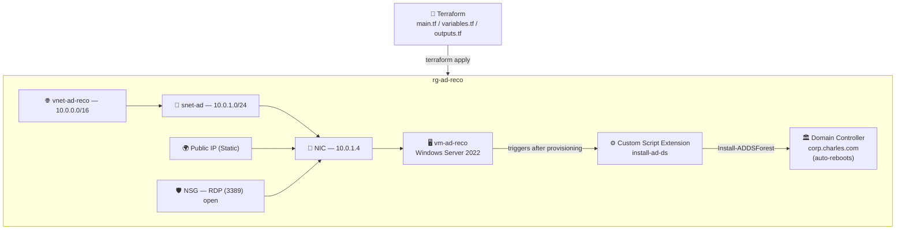

# ☁️ Lab 06 — Deploying an Active Directory Domain Controller with Terraform


A hands-on lab where I used Terraform to deploy a Windows Server 2022 VM and **fully automate its promotion to an Active Directory Domain Controller** — networking, VM provisioning, and AD DS installation, all in a single `terraform apply`.

---

## 📌 Overview

Standing up a domain controller usually means: deploy a VM, RDP in, click through the "Add Roles and Features" wizard, promote to a new forest, and reboot — all done by hand. This lab replaces every one of those manual steps with a **Terraform Custom Script Extension** that runs unattended immediately after the VM boots.

| Detail | Value |
|---|---|
| **Difficulty** | Intermediate |
| **Time to complete** | ~15–20 minutes (5–8 min deploy + 3–5 min AD DS install/reboot) |
| **Cloud Provider** | Microsoft Azure |
| **Core Services** | Terraform, Azure VM (Windows Server 2022), Custom Script Extension, AD DS |
| **Core Concept** | Fully automated infrastructure + role configuration in one workflow |

---

## 🏗️ Architecture



**How it works:** Terraform provisions the network stack and VM first. Once the VM is running, the **Custom Script Extension** executes a PowerShell command that installs the `AD-Domain-Services` Windows feature and runs `Install-ADDSForest`, standing up a brand-new AD forest and rebooting the server automatically — no manual GUI steps at any point.

> 🔑 **After the reboot, authentication changes.** The VM is no longer a standalone machine — log in with `CORP\adadmin` or `adadmin@corp.charles.com`, not the local account syntax.

---

## ✅ Prerequisites

- Azure CLI installed and authenticated (`az login`)
- Terraform v1.3+
- Active Azure subscription
- A local directory for the Terraform project files

---

## 🏷️ Key Variables

| Variable | Example Value | Notes |
|---|---|---|
| `yourname` | `reco` | Used to keep resource names unique |
| `location` | `eastus` | Azure region |
| `domain_name` | `corp.charles.com` | Fully qualified AD domain name |
| `domain_netbios` | `CORP` | NetBIOS name, 15 characters max |
| `admin_password` | *(sensitive)* | Local VM admin password |
| `dsrm_password` | *(sensitive)* | Directory Services Restore Mode password — **cannot be retrieved after deployment** |

---

## 🚀 Deployment Steps

### Part 1 — Scaffold the Project
```bash
mkdir -p ~/repos/az-ad-vm && cd ~/repos/az-ad-vm
touch main.tf variables.tf outputs.tf terraform.tfvars
```

### Part 2 — Write the Terraform Configuration

**`main.tf`** declares the full stack: resource group, VNet, subnet, static public IP, NSG (RDP inbound), NIC, the Windows Server 2022 VM, and the Custom Script Extension that runs:

```powershell
Install-WindowsFeature -Name AD-Domain-Services -IncludeManagementTools
Import-Module ADDSDeployment
Install-ADDSForest `
  -DomainName '<domain_name>' `
  -DomainNetbiosName '<domain_netbios>' `
  -ForestMode 'WinThreshold' `
  -DomainMode 'WinThreshold' `
  -InstallDns:$true `
  -SafeModeAdministratorPassword (ConvertTo-SecureString '<dsrm_password>' -AsPlainText -Force) `
  -Force:$true
```

**`variables.tf`** defines all inputs, marking `admin_password` and `dsrm_password` as `sensitive = true` so Terraform masks them in console output.

**`terraform.tfvars`** supplies the actual values:
```hcl
yourname       = "reco"
location       = "eastus"
admin_password = "[REDACTED]"
dsrm_password  = "[REDACTED]"
domain_name    = "corp.charles.com"
domain_netbios = "CORP"
```

**`outputs.tf`** surfaces the public IP, domain name, and admin username after apply.

### Part 3 — Deploy
```bash
terraform init
terraform plan
terraform apply
```
The VM provisions first (~5–8 min), then the extension installs AD DS and reboots the server (~3–5 min more).

### Part 4 — Connect via RDP
```bash
terraform output public_ip
```

| Method | Username | When to Use |
|---|---|---|
| Domain prefix | `CORP\adadmin` | ✅ Standard — try this first |
| UPN format | `adadmin@corp.charles.com` | If domain prefix fails |
| Local account | `.\adadmin` | Only if AD promotion failed |

⏳ **Wait 5–10 minutes after `apply` completes** before attempting to RDP — connecting during the post-promotion reboot can produce a failed session or black screen.

### Part 5 — Verify AD DS
From an RDP session, in an elevated PowerShell prompt:

```powershell
Get-Service NTDS | Select-Object Name, Status      # AD DS service running
Get-ADDomain                                         # Domain configuration
Get-ADDomainController -Filter *                     # Lists this DC
Resolve-DnsName corp.charles.com                      # DNS resolving correctly
```
All four should return without errors.

---

## 🐛 Troubleshooting

Check extension status directly from your local machine:
```bash
az vm extension show \
  --resource-group rg-ad-reco \
  --vm-name vm-ad-reco \
  --name install-ad-ds \
  --query "provisioningState" \
  --output tsv
```

| Issue | Cause | Fix |
|---|---|---|
| RDP password not working | VM rebooted after promotion — auth now needs domain credentials | Use `CORP\adadmin` or `adadmin@corp.charles.com` |
| Extension status: `Failed` | AD DS installation failed mid-run | Check `C:\WindowsAzure\Logs` on the VM; re-run `terraform apply` to retry |
| RDP black screen | VM still mid-reboot after AD DS install | Wait 5 minutes and retry |
| `Get-ADDomain` not found | AD module not loaded in session | Run `Import-Module ActiveDirectory`, then retry |

---

## 🧹 Teardown
```bash
terraform destroy
```
Removes the resource group and everything inside it — VM, disks, NIC, public IP, NSG, VNet, and subnet.

---

## 🔐 Security Notes

This lab is optimized for fast, repeatable learning — which means it intentionally cuts corners that would need to be addressed before this pattern touches production:

- **RDP is open to `*` (any source IP) on port 3389.** This is acceptable for a short-lived, disposable lab VM, but in any real environment this should be scoped to a specific IP range, placed behind a VPN/bastion, or replaced with **Azure Bastion** entirely — RDP directly exposed to the internet is a top initial-access vector for ransomware.
- **Passwords live in plaintext in `terraform.tfvars`.** Marking variables `sensitive = true` only masks them from console *output* — it does not encrypt them at rest. In production, secrets like `admin_password` and `dsrm_password` belong in **Azure Key Vault** referenced via a data source, not committed to a `.tfvars` file (which should never be checked into source control).
- **The DSRM password cannot be recovered after deployment.** Since this is set once during forest creation, losing it means losing the ability to perform certain AD disaster-recovery operations — treat it with the same handling rigor as a root credential.
- **A single domain controller is a single point of failure.** Production AD environments deploy at least two DCs in separate fault/update domains — this lab's one-DC design is for learning the automation pattern, not a resilient topology.
- **Standing up a forest via unattended script is powerful — and dangerous if the script leaks.** The full `Install-ADDSForest` command, including the DSRM password, is passed as a plaintext command line to the VM extension; this is visible in Azure Activity Logs and VM diagnostic logs, another reason this pattern needs Key Vault integration before real use.

---

## 📚 What I Learned

- Automating full server role installation (not just infrastructure) via Terraform's Custom Script Extension
- Writing `Install-ADDSForest` unattended promotion scripts for AD DS
- Managing Terraform-sensitive variables and understanding their real limitations
- Handling post-promotion authentication changes (local → domain credentials)
- Diagnosing VM extension failures using Azure CLI and on-box logs
- Identifying the gap between "lab-fast" and "production-safe" infrastructure patterns

---

**Author:** Reco
